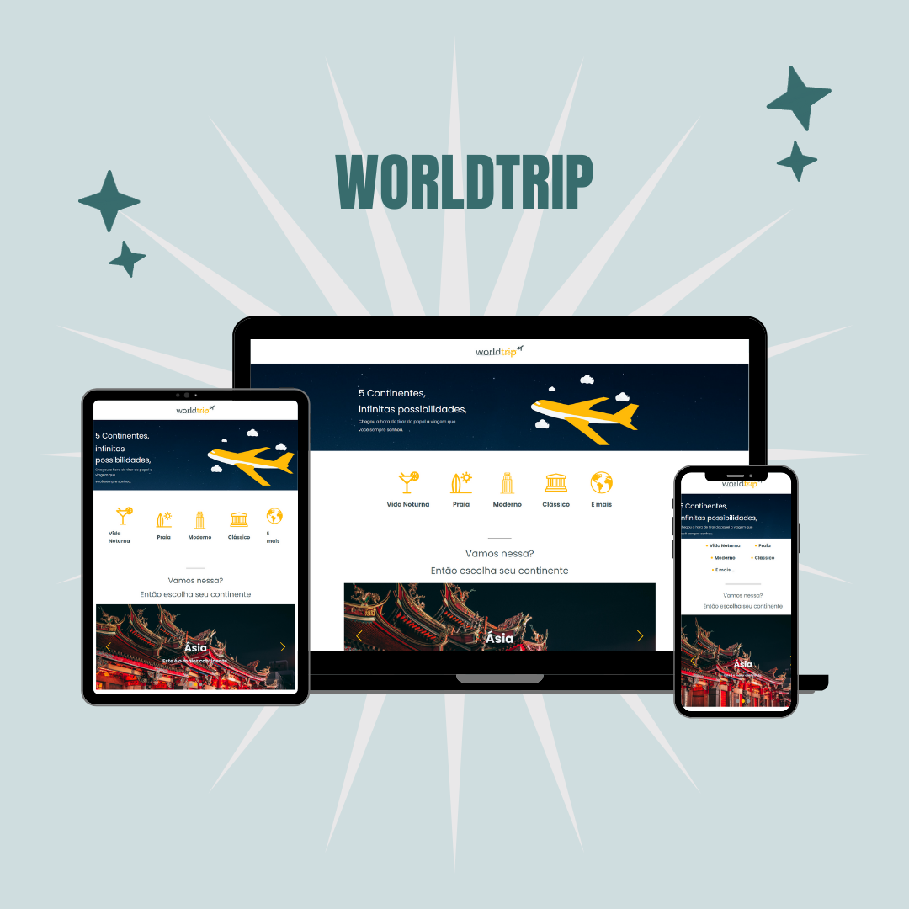

<h2 align="center"> 
  :airplane: Worldtrip
</h1>

<p align="center">
  <a href="https://www.linkedin.com/in/frank-laercio/">
    
  </a>
  
  
  
  <a href="https://github.com/franklaercio/ig-news/commits/master">
    
  </a>
  
  

  
   <a href="https://github.com/franklaercio/reactjs-worldtrip/stargazers">
    
  </a>
</p>

## :bookmark_tabs: Resume of application

This is a simple example of a blog trip. You can view continents and cities to discover the best trip. In addition, this project was developed during the Ignite of Rocketseat.

<p align="center">
  
</p>

## 🎲 Running the project

```bash
# Clone this repository
$ git clone https://github.com/franklaercio/reactjs-worldtrip

# Access the project folder in the terminal/cmd
$ cd reactjs-worldtrip

# Run the application
$ yarn dev
```

## :man_technologist: Authors

* **Frank Laércio** - [franklaercio](https://github.com/franklaercio)

See also the list of [contributors](https://github.com/franklaercio/restaurant-react/contributors) who participated in this project.

## :clipboard: License

This project is licensed under the MIT License - see the [LICENSE.md](LICENSE.md) file for details

## :newspaper: Acknowledgments

- React
- Next.js
- ChakaraUI
- Typescript

Feito com :hearts: by Frank Laércio :wave:!

